# Re-kNN 評価レポート: CIFAR-10

> **"Deterministic logic reveals the truth hidden in high-dimensional noise."**

このレポートでは、CIFAR-10 データセット（テストデータ 10,000 件）に対する Re-kNN の推論性能を、未知判定閾値（decision threshold）ごとに評価した結果を示す。

## 実験条件

特に断りがない限り、本レポートの結果は以下の条件で取得した。

- インデックス登録対象データ: CIFAR-10 50,000 件
- 評価データ: CIFAR-10 テストデータ 10,000 件
- 近傍数: k = 1
- インデックス構築時の Similarity: 0.98
- 未知判定閾値 (decision threshold): 各表に記載
- Refine: なし
- 実行環境: Ryzen 9 5900HX / Windows 11 / .NET 8

CIFAR-10 は、データの特性上、Refine 処理を行わない。

### 補足

この評価は画像をベクトルとして評価した結果である。特徴量抽出などの画像に特化した処理は行っていない。

## 1. Re-kNN の性能

| 未知判定閾値 (decision threshold) | 正答率 (Total Acc) | 未知判定率 | 誤答率 | 既知正答率 (Accuracy excluding Unknown) | 正答数 | 未知判定数 | 誤答数 | 備考 |
|:---|:---|:---|:---|:---|---:|---:|---:|:---|
| **0.5** | 0.3272 | 0.0000 | 0.6728 | 0.3272 | 3272 | 0 | 6728 | 実用ケースを想定 |
| **0.7** | 0.3272 | 0.0003 | 0.6725 | 0.3273 | 3272 | 3 | 6725 | 信頼性重視設定 |
| **0.9** | 0.2957 | 0.1330 | 0.5713 | 0.3411 | 2957 | 1330 | 5713 | 高信頼性設定 |

> * 正答率 (Total Acc) = 正答数 / 全テストデータ数 (10,000)
> * 既知正答率 (Accuracy excluding Unknown) = 正答数 / (正答数 + 誤答数)
> * 未知判定率 = 未知判定数 / 全テストデータ数 (10,000) 
> * 誤答率 = 誤答数 / 全テストデータ数 (10,000)

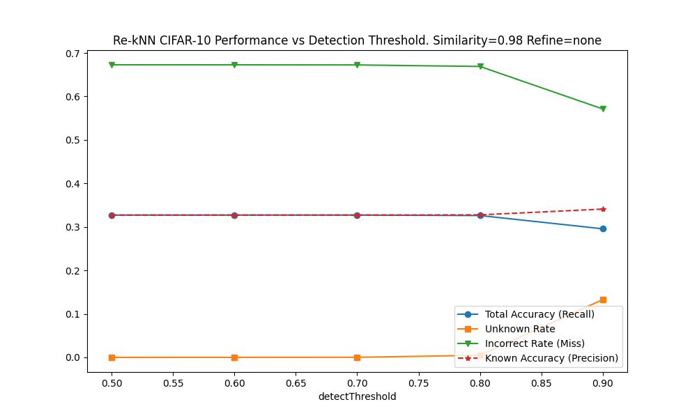

CIFAR-10 では、未知判定閾値を 0.5 から 0.7 に上げても総正答率はほぼ変化せず、未知判定はほとんど増えない。一方、0.9 まで上げると未知判定が増加し、既知正答率はわずかに向上する。

### 混同行列

以下に混同行列を示す。

#### 未知判定閾値: 0.5

| テストラベル | 推論:0 | 推論:1 | 推論:2 | 推論:3 | 推論:4 | 推論:5 | 推論:6 | 推論:7 | 推論:8 | 推論:9 | 推論:未知 |
|:--:|--:|--:|--:|--:|--:|--:|--:|--:|--:|--:|--:|
| 0 | 328 | 30 | 59 | 18 | 37 | 17 | 115 | 52 | 184 | 21 | 139 |
| 1 | 65 | 200 | 33 | 53 | 43 | 35 | 67 | 36 | 145 | 71 | 252 |
| 2 | 81 | 9 | 167 | 70 | 157 | 37 | 152 | 61 | 40 | 5 | 221 |
| 3 | 48 | 12 | 67 | 152 | 103 | 109 | 134 | 50 | 45 | 16 | 264 |
| 4 | 64 | 8 | 100 | 63 | 286 | 33 | 164 | 60 | 30 | 8 | 184 |
| 5 | 35 | 8 | 81 | 131 | 105 | 184 | 94 | 52 | 44 | 14 | 252 |
| 6 | 28 | 13 | 68 | 97 | 155 | 65 | 275 | 45 | 24 | 5 | 225 |
| 7 | 52 | 7 | 75 | 64 | 134 | 56 | 78 | 242 | 46 | 29 | 217 |
| 8 | 141 | 44 | 16 | 20 | 25 | 9 | 56 | 24 | 472 | 19 | 174 |
| 9 | 89 | 67 | 40 | 58 | 51 | 26 | 54 | 44 | 137 | 196 | 238 |

#### 未知判定閾値: 0.7

| テストラベル | 推論:0 | 推論:1 | 推論:2 | 推論:3 | 推論:4 | 推論:5 | 推論:6 | 推論:7 | 推論:8 | 推論:9 | 推論:未知 |
|:--:|--:|--:|--:|--:|--:|--:|--:|--:|--:|--:|--:|
| 0 | 252 | 16 | 29 | 8 | 17 | 8 | 111 | 23 | 133 | 8 | 395 |
| 1 | 38 | 121 | 17 | 20 | 12 | 14 | 52 | 16 | 93 | 30 | 587 |
| 2 | 50 | 5 | 97 | 28 | 99 | 17 | 127 | 29 | 17 | 1 | 530 |
| 3 | 29 | 5 | 31 | 76 | 60 | 42 | 86 | 25 | 31 | 5 | 610 |
| 4 | 37 | 4 | 66 | 22 | 184 | 19 | 129 | 38 | 22 | 5 | 474 |
| 5 | 17 | 4 | 53 | 59 | 48 | 96 | 65 | 25 | 25 | 2 | 606 |
| 6 | 15 | 6 | 33 | 46 | 105 | 22 | 199 | 27 | 14 | 2 | 531 |
| 7 | 33 | 5 | 47 | 28 | 77 | 26 | 62 | 160 | 27 | 15 | 520 |
| 8 | 89 | 18 | 9 | 9 | 14 | 4 | 54 | 17 | 342 | 7 | 437 |
| 9 | 49 | 27 | 18 | 22 | 28 | 10 | 43 | 18 | 92 | 115 | 578 |

#### 未知判定閾値: 0.9

| テストラベル | 推論:0 | 推論:1 | 推論:2 | 推論:3 | 推論:4 | 推論:5 | 推論:6 | 推論:7 | 推論:8 | 推論:9 | 推論:未知 |
|:--:|--:|--:|--:|--:|--:|--:|--:|--:|--:|--:|--:|
| 0 | 133 | 4 | 5 | 1 | 4 | 2 | 85 | 9 | 53 | 2 | 702 |
| 1 | 5 | 58 | 3 | 1 | 0 | 0 | 34 | 2 | 26 | 9 | 862 |
| 2 | 14 | 1 | 41 | 5 | 29 | 2 | 101 | 4 | 5 | 0 | 798 |
| 3 | 3 | 1 | 11 | 28 | 14 | 14 | 62 | 8 | 6 | 1 | 852 |
| 4 | 15 | 1 | 20 | 5 | 80 | 2 | 96 | 13 | 14 | 2 | 752 |
| 5 | 7 | 0 | 12 | 21 | 17 | 57 | 48 | 5 | 12 | 1 | 820 |
| 6 | 4 | 4 | 9 | 8 | 33 | 4 | 137 | 3 | 6 | 1 | 791 |
| 7 | 12 | 0 | 9 | 5 | 18 | 9 | 48 | 104 | 8 | 5 | 782 |
| 8 | 26 | 4 | 1 | 4 | 2 | 1 | 48 | 6 | 196 | 4 | 708 |
| 9 | 12 | 7 | 2 | 2 | 2 | 2 | 30 | 5 | 22 | 76 | 840 |

## 2. Re-kNN が誤答をしたケース

未知判定閾値 = 0.7 として実行した際の誤答ケースの解析結果を以下に示す。

全誤答件数: 6725

### 例1: ラベル=cat のデータを ラベル=horse として誤答したケース

#### テストラベル
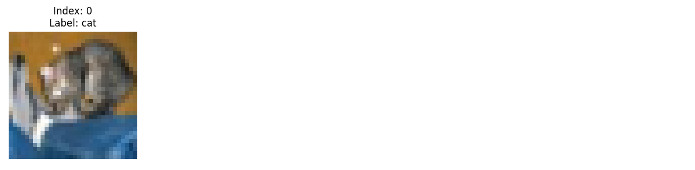

#### 判定根拠データ
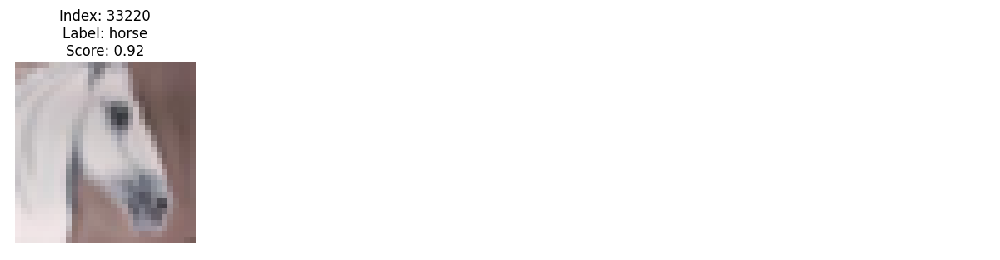

### 例2: ラベル=frog のデータを ラベル=cat として誤答したケース

#### テストラベル
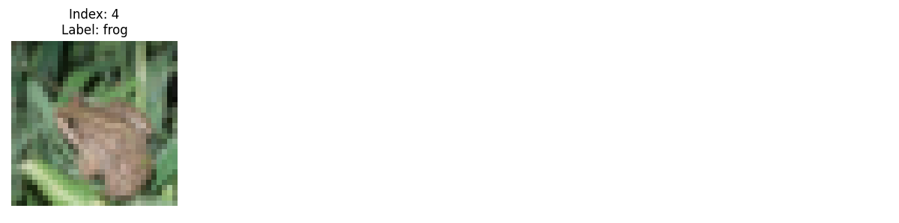

#### 判定根拠データ
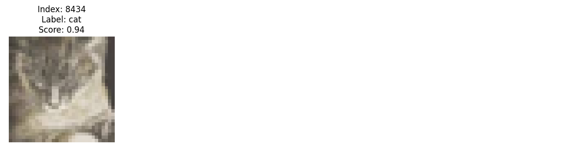

### 例3: ラベル=automobile のデータを ラベル=frog として誤答したケース

#### テストラベル
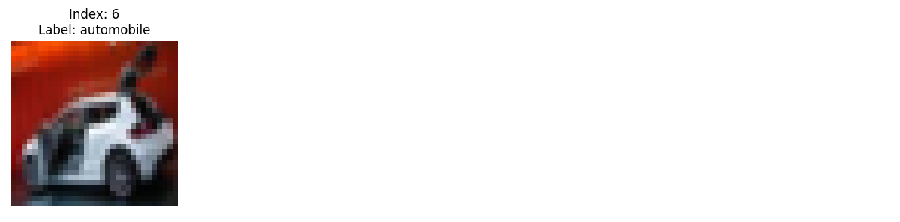

#### 判定根拠データ
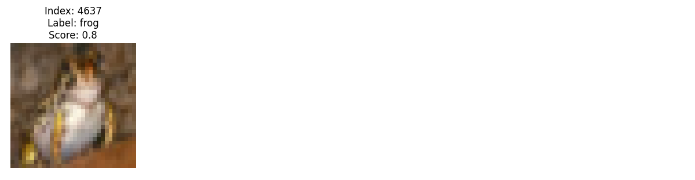

## 3. Re-kNN が未知データと判定したケース

未知判定閾値 = 0.7 として実行した際の未知判定ケースの解析結果を以下に示す。

全未知判定件数: 3

### 例1: ラベル=truck のデータを未知と判定したケース

#### テストラベル

#### 判定根拠データ
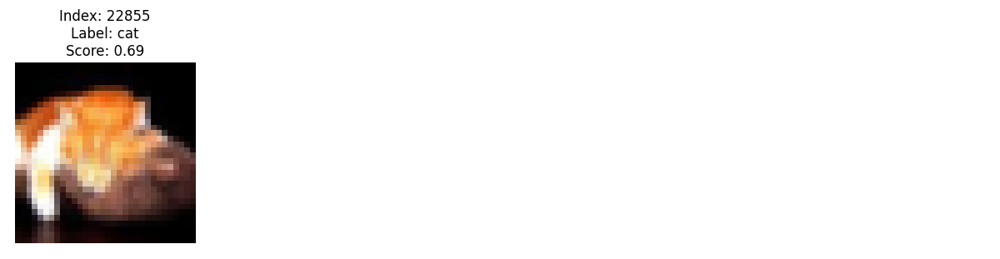

### 例2: ラベル=airplane のデータを未知と判定したケース

#### テストラベル
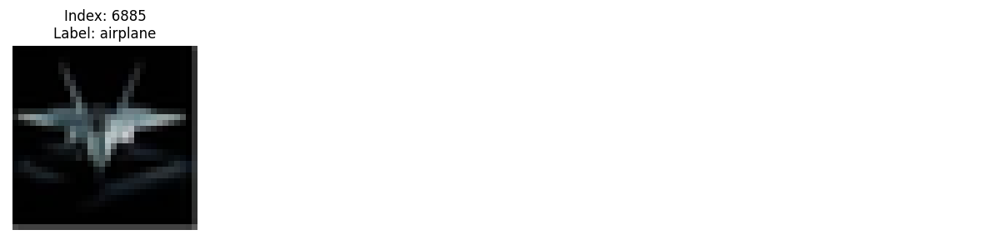

#### 判定根拠データ
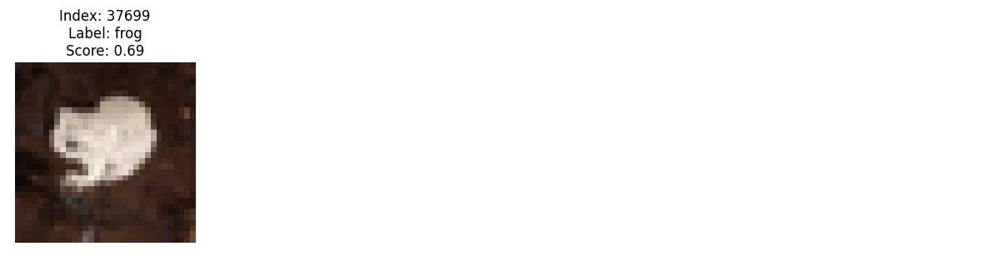

### 例3: ラベル=cat のデータを未知と判定したケース

#### テストラベル
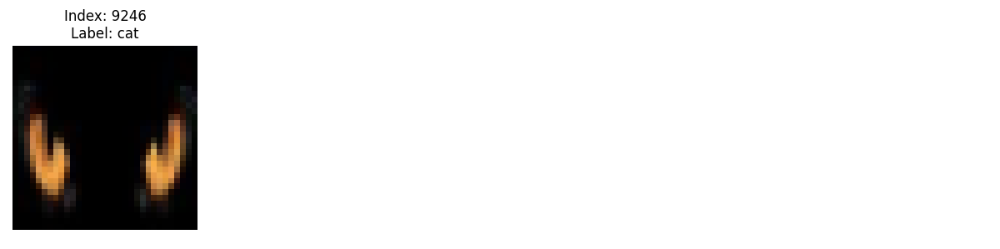

#### 判定根拠データ
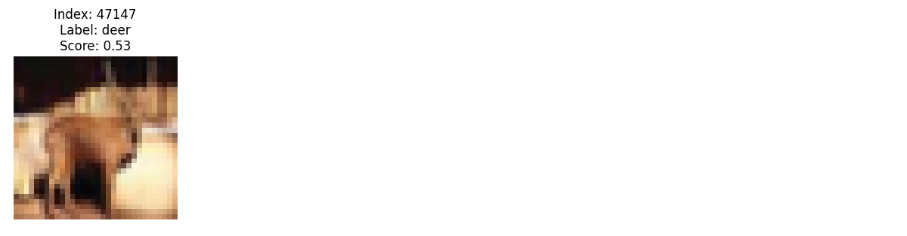

## 4. Re-kNN が正しく判定したケース

未知判定閾値 = 0.7 として実行した際の正答ケースの解析結果を以下に示す。

全正答件数: 3272

### 例1: ラベル=ship のデータを正しく判定したケース

#### テストラベル
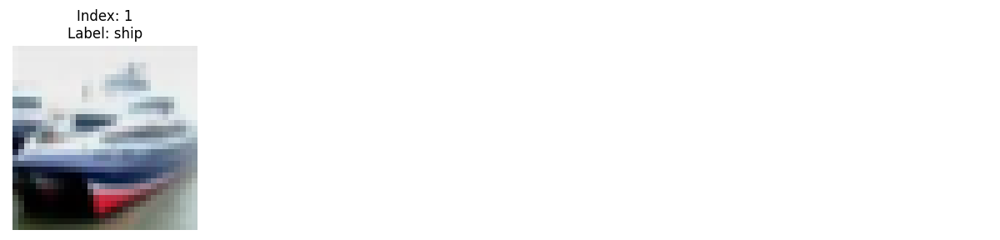

#### 判定根拠データ
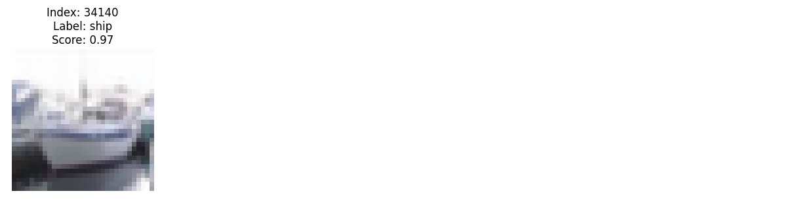

### 例2: ラベル=ship のデータを正しく判定したケース

#### テストラベル
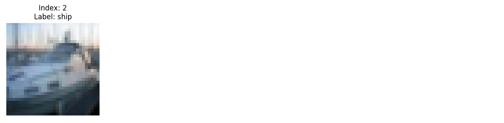

#### 判定根拠データ
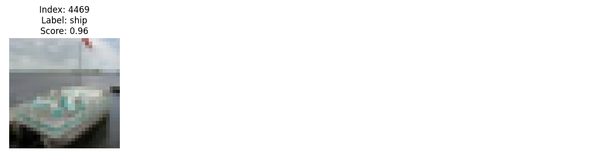

### 例3: ラベル=airplane のデータを正しく判定したケース

#### テストラベル
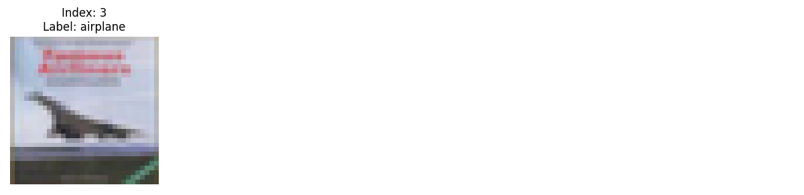

#### 判定根拠データ
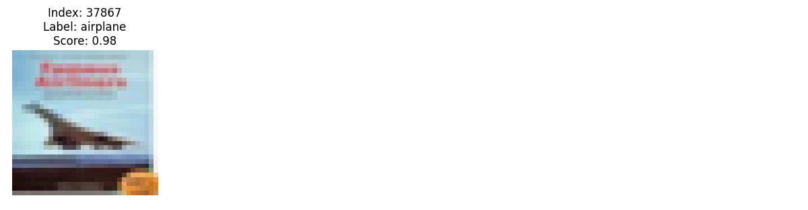

## 5. 推論時間

CIFAR-10の全テストデータ(10,000件)に対して推論を行った際の所要時間を以下に示す。

* **測定環境**: Ryzen 9 5900HX (3.3GHz) / Windows 11 / .NET 8
* **対象データ**: CIFAR-10 (3072次元)
* **総処理時間 (10,000件)**: $27,369.73 ms$
* **1件あたりの平均レイテンシ**: **$2.74 ms$**

## 6. 未知の判別

CIFAR-10 において、0から9のラベルをそれぞれインデックス登録しない状態で評価を行った際の結果を以下に示す。未知判定閾値 = 0.7, インデックス構築時の Similarity = 0.95 での評価結果である。

### 未知を含めて評価した結果

| 未知ラベル | 正答率 (Total Acc) | 未知判定率 | 誤答率 | 正答数 | 未知判定数 | 誤答数 | 備考 |
|:---:|:---|:---|:---|---:|---:|---:|:---|
| 0 | 0.1615 | 0.5489 | 0.2896 | 1615 | 5489 | 2896 |  |
| 1 | 0.1565 | 0.5422 | 0.3013 | 1565 | 5422 | 3013 |  |
| 2 | 0.1724 | 0.5233 | 0.3043 | 1724 | 5233 | 3043 |  |
| 3 | 0.1765 | 0.5200 | 0.3035 | 1765 | 5200 | 3035 |  |
| 4 | 0.1678 | 0.5274 | 0.3048 | 1678 | 5274 | 3048 |  |
| 5 | 0.1696 | 0.5256 | 0.3048 | 1696 | 5256 | 3048 |  |
| 6 | 0.1553 | 0.5387 | 0.3060 | 1553 | 5387 | 3060 |  |
| 7 | 0.1629 | 0.5197 | 0.3174 | 1629 | 5197 | 3174 |  |
| 8 | 0.1502 | 0.5586 | 0.2912 | 1502 | 5586 | 2912 |  |
| 9 | 0.1528 | 0.5429 | 0.3043 | 1528 | 5429 | 3043 |  |
| なし | 0.1642 | 0.5268 | 0.3090 | 1642 | 5268 | 3090 |  |

.png)

.png)

### 未知を除外した状態での評価結果

| 未知ラベル | 正答率 (Total Acc) | 既知正答率 (Accuracy excluding Unknown) | 正答数 | 誤答数 | 未知判定数 | 備考 |
|:---:|:---|:---|---:|---:|---:|:---|
| 0 | 0.1794 | 0.4019 | 1615 | 2403 | 4982 |  |
| 1 | 0.1739 | 0.3702 | 1565 | 2662 | 4773 |  |
| 2 | 0.1916 | 0.4034 | 1724 | 2550 | 4726 |  |
| 3 | 0.1961 | 0.4017 | 1765 | 2629 | 4606 |  |
| 4 | 0.1864 | 0.3943 | 1678 | 2578 | 4744 |  |
| 5 | 0.1884 | 0.3898 | 1696 | 2655 | 4649 |  |
| 6 | 0.1726 | 0.3711 | 1553 | 2632 | 4815 |  |
| 7 | 0.1810 | 0.3716 | 1629 | 2755 | 4616 |  |
| 8 | 0.1669 | 0.3811 | 1502 | 2439 | 5059 |  |
| 9 | 0.1698 | 0.3682 | 1528 | 2622 | 4850 |  |
| なし | 0.1642 | 0.3470 | 1642 | 3090 | 5268 |  |

.png)

.png)

### 未知の評価結果

インデックスに登録しなかったラベル(=未知ラベル)の判定結果は **未知** もしくは **誤答** のどちらかとなる。

| 未知ラベル | 未知判定率 | 誤答率 | 未知判定数 | 誤答数 | 備考 |
|:---:|:---|:---|---:|---:|:---|
| 0 | 0.507 | 0.493 | 507 | 493 |  |
| 1 | 0.649 | 0.351 | 649 | 351 |  |
| 2 | 0.507 | 0.493 | 507 | 493 |  |
| 3 | 0.594 | 0.406 | 594 | 406 |  |
| 4 | 0.530 | 0.470 | 530 | 470 |  |
| 5 | 0.607 | 0.393 | 607 | 393 |  |
| 6 | 0.572 | 0.428 | 572 | 428 |  |
| 7 | 0.581 | 0.419 | 581 | 419 |  |
| 8 | 0.527 | 0.473 | 527 | 473 |  |
| 9 | 0.579 | 0.421 | 579 | 421 |  |

.png)

## 7. 考察

CIFAR-10 は、生ピクセルベクトルのままでは正答率が低い。これは、3,072 次元という高次元空間に対して、50,000 件というデータ数では密度が十分でないことが一因であると推測している。
Re-kNN では、検索した結果、スコアの高いデータを判定根拠データとしている。
今回の誤答では、高スコアで得られた近傍データが異なるラベルを持っていた。つまり、同一ラベルの十分に類似したデータが近傍に存在しなかった可能性がある。
これは、空間内のデータ密度が疎であることを示唆している。

また、上記のようなデータの特性もあるため、未知データ判定のスコアも同様に低くなる。
これは Re-kNN 固有の性能限界というより、CIFAR-10 を生ピクセルベクトルのまま扱うことによるデータ特性の影響が強く表れている可能性がある。

この結果は、ベクトル検索をベースとした Re-kNN では、ベクトル空間に充填されているデータの密度が重要であることを示唆している。

## 8. メモリ消費

CIFAR10のデータを全て読み込んだ状態でのメモリ消費量を以下に示す。

* **測定環境**: Ryzen 9 5900HX (3.3GHz) / Windows 11 / .NET 8
* **測定条件**: インデックス情報を全て読み込んだ直後の状態
* **他プロセス条件**: Windows で動作する他のプロセスは稼働中である
* **対象データ**: CIFAR-10 (3072次元)
* **メモリ消費量**: 2000.0MB (タスクマネージャーのプロセスタブのメモリ項目での測定値) ※暫定値

---
*Created by Re-kNN Evaluation Suite (2026)*
