# Re-kNN における大規模データのクラスタリング

Re-kNN は、その処理の過程で動的クラスタリング (Dynamic Clustering) を行っている。その副産物として、クラスタ情報を出力することが可能である。

クラスタ情報は、データの登録・削除が行われる任意のタイミングで取得可能である。
これは、Re-kNN の内部で行っている **動的クラスタリング** の特徴でもある。
データの追加・削除が頻繁に発生するユースケースにおいて、この特徴は大きな利点となり得る。

このドキュメントは、クラスタ品質に関するデータとその結果の考察を述べる。

## 1. クラスタリングの特徴

本クラスタリング処理の特徴は以下の通りである。

- クラスタ数: データの分布を元にシステムが決定する。多くの場合、総データ数の 1/20 以下となる。k-means 系の手法に比較して、クラスタ数は多くなる。
- クラスタ品質: 初期のクラスタリング結果にはノイズを含む場合がある。Refine 処理を行うことで、品質の向上が期待される。
- クラスタ更新タイミング: 随時。クラスタ情報は、データの追加・削除のタイミングで常にメンテナンスされる。
- 並列化: 現時点では並列化を行っていない。そのため、高度な並列実行環境を前提としない。

クラスタ情報は副産物として得られるものであるため、利用者がクラスタ数を直接指定することはできない。

## 2. クラスタリング結果

MNIST のトレーニングデータ 60,000 件をクラスタリングした結果、2,262 件のクラスタを生成した。
インデックス構築時の Similarity は 0.9 を設定している。
生成したクラスタの特徴を以下に示す。

### クラスタ品質

ここでのクラスタ品質は、クラスタ内で最も頻度の高いラベルの頻度をクラスタ総データ数で割ったものとして定義する。

$クラスタ品質 = \frac{クラスタ内の頻度の最も高いラベルの頻度}{クラスタの総データ数}$

この式を元に、クラスタの品質をヒストグラムで表現したものを以下に示す。

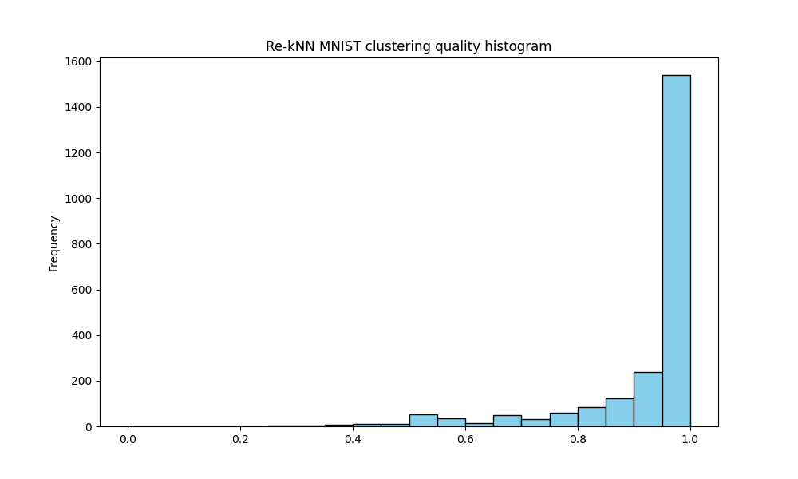

| クラスタ品質(始点) | クラスタ品質(終点) | クラスタ数 |
|---:|---:|---:|
| 0.00 | 0.05 |    0 |
| 0.05 | 0.10 |    0 |
| 0.10 | 0.15 |    0 |
| 0.15 | 0.20 |    0 |
| 0.20 | 0.25 |    0 |
| 0.25 | 0.30 |    3 |
| 0.30 | 0.35 |    3 |
| 0.35 | 0.40 |    7 |
| 0.40 | 0.45 |   10 |
| 0.45 | 0.50 |   12 |
| 0.50 | 0.55 |   52 |
| 0.55 | 0.60 |   35 |
| 0.60 | 0.65 |   15 |
| 0.65 | 0.70 |   50 |
| 0.70 | 0.75 |   31 |
| 0.75 | 0.80 |   58 |
| 0.80 | 0.85 |   85 |
| 0.85 | 0.90 |  122 |
| 0.90 | 0.95 |  239 |
| 0.95 | 1.00 | 1540 |

高品質のクラスタが大半を占める一方で、品質の低いクラスタも一定数検出されている。低品質クラスタには、判別の難しいデータが含まれている傾向がある。

### クラスタサイズ

生成したクラスタのサイズをヒストグラム化したものを以下に示す。

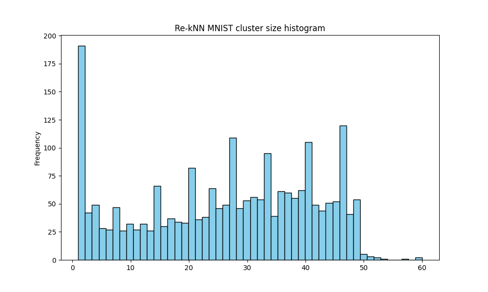

| クラスタサイズ(始点) | クラスタサイズ(終点) | クラスタ数 |
|---:|---:|---:|
| 1 | 3 | 233 |
| 4 | 6 | 104 |
| 7 | 9 |  73 |
| 10 | 12 |  91 |
| 13 | 15 |  92 |
| 16 | 18 | 101 |
| 19 | 21 | 115 |
| 22 | 24 | 138 |
| 25 | 27 | 147 |
| 28 | 30 | 156 |
| 31 | 33 | 158 |
| 34 | 36 | 147 |
| 37 | 39 | 177 |
| 40 | 42 | 154 |
| 43 | 45 | 147 |
| 46 | 48 | 161 |
| 49 | 51 |  62 |
| 52 | 54 |   3 |
| 55 | 57 |   1 |
| 58 | 60 |   2 |

クラスタサイズは50以下のものがほとんどである。51以下のサイズのクラスタの割合は 99.7\% となる。これは、60,000 件のデータをクラスタ数で割ると、約27件であることを考えると、妥当である。

### 高品質クラスタのサンプル

ここでは、 $クラスタ品質 = 1.0$ であるような例をいくつかサンプルとして挙げる。
ただし、クラスタに所属するデータ数が 5未満のものは除外している。

#### ケース1: クラスタ所属データ数 = 12

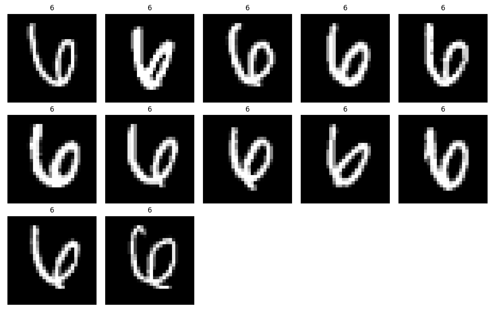

#### ケース2: クラスタ所属データ数 = 7

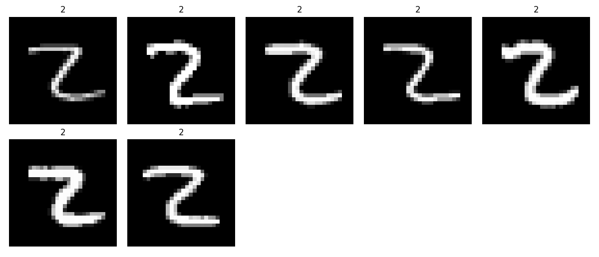

#### ケース3: クラスタ所属データ数 = 6

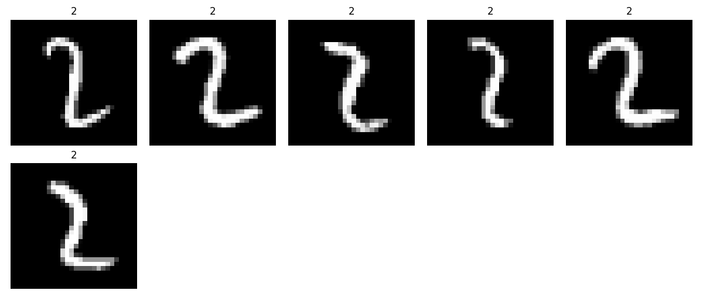

### ノイズ混入クラスタのサンプル

ここでは、 $0.9 \le クラスタ品質 \lt 1.0$ であるような例をいくつかサンプルとして挙げる。
ただし、クラスタに所属するデータ数が 5未満のものは除外している。

#### ケース1: クラスタ所属データ数 = 32

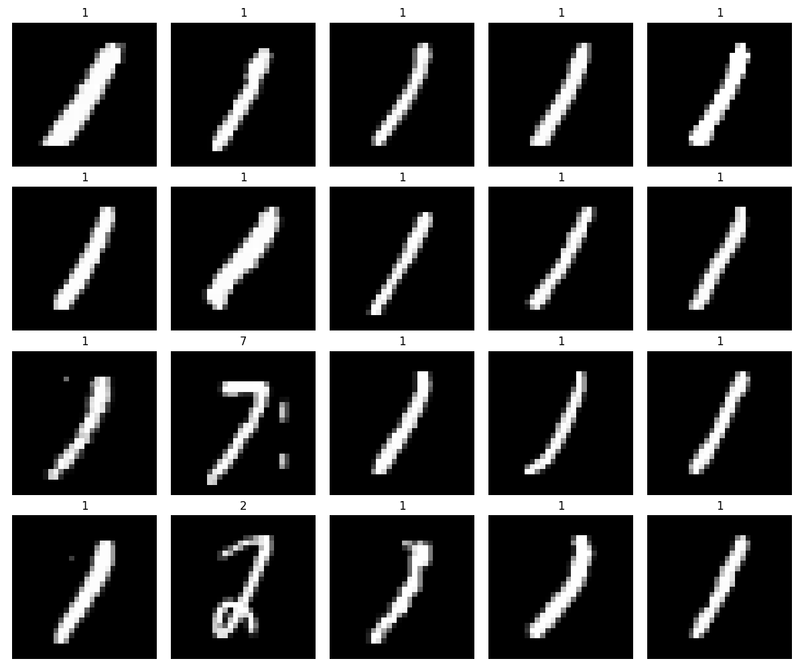

* 画像は、20件に絞って表示している

#### ケース2: クラスタ所属データ数 = 45

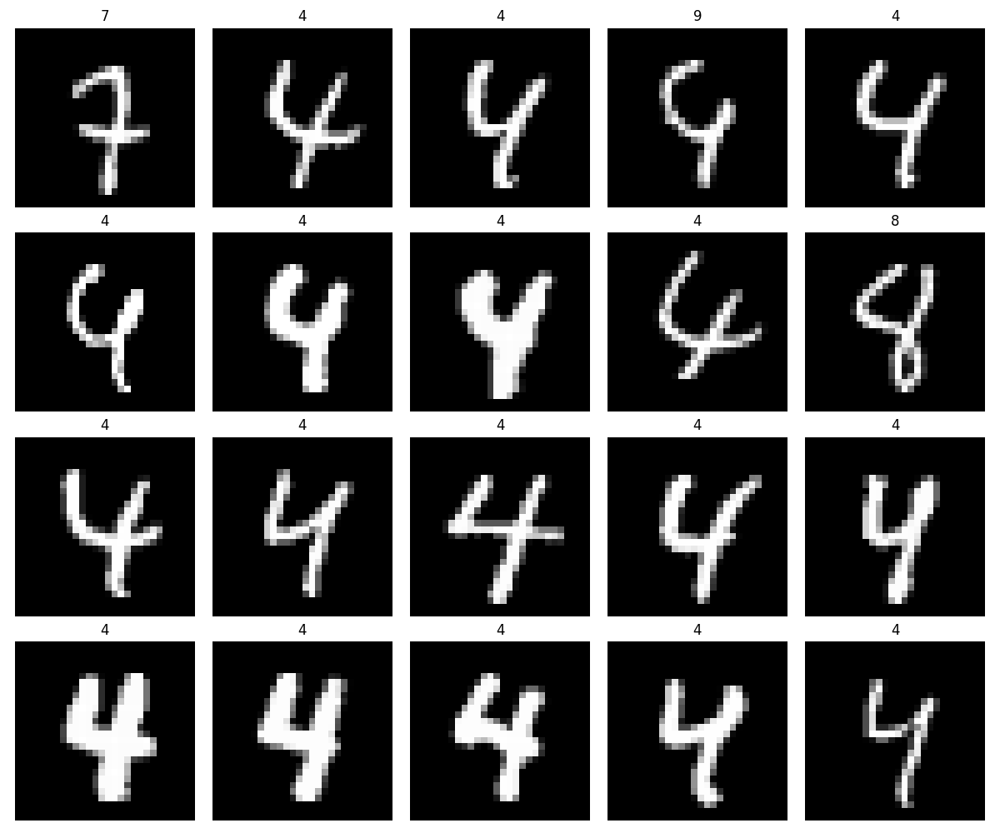

* 画像は、20件に絞って表示している

#### ケース3: クラスタ所属データ数 = 45

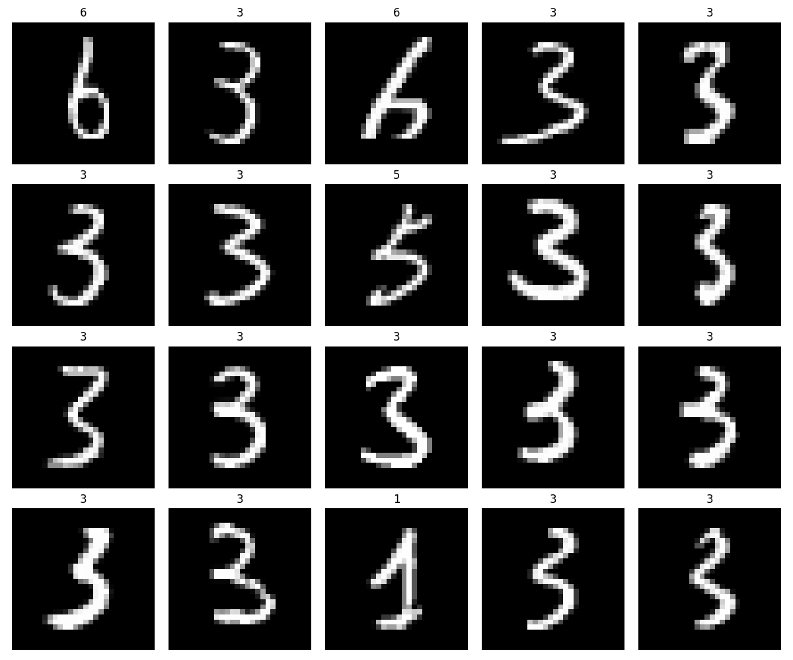

* 画像は、20件に絞って表示している

### 低品質クラスタのサンプル

ここでは、 $クラスタ品質 \lt 0.5$ であるような例をいくつかサンプルとして挙げる。
ただし、クラスタに所属するデータ数が 2未満のものは除外している。

#### ケース1: クラスタ所属データ数 = 31

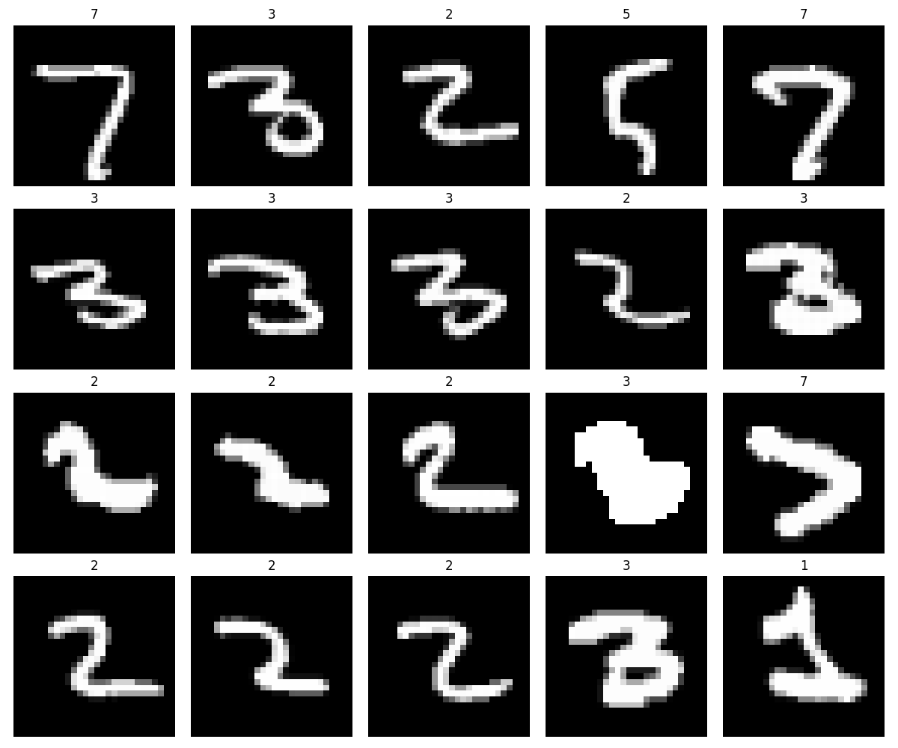

* 画像は、20件に絞って表示している

#### ケース2: クラスタ所属データ数 = 31

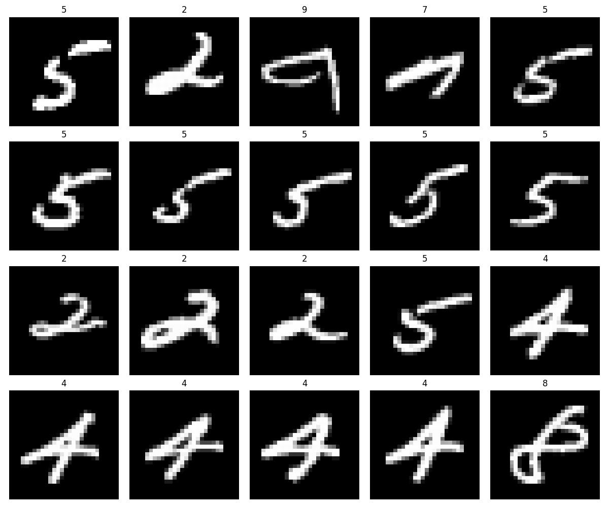

* 画像は、20件に絞って表示している

#### ケース3: クラスタ所属データ数 = 13

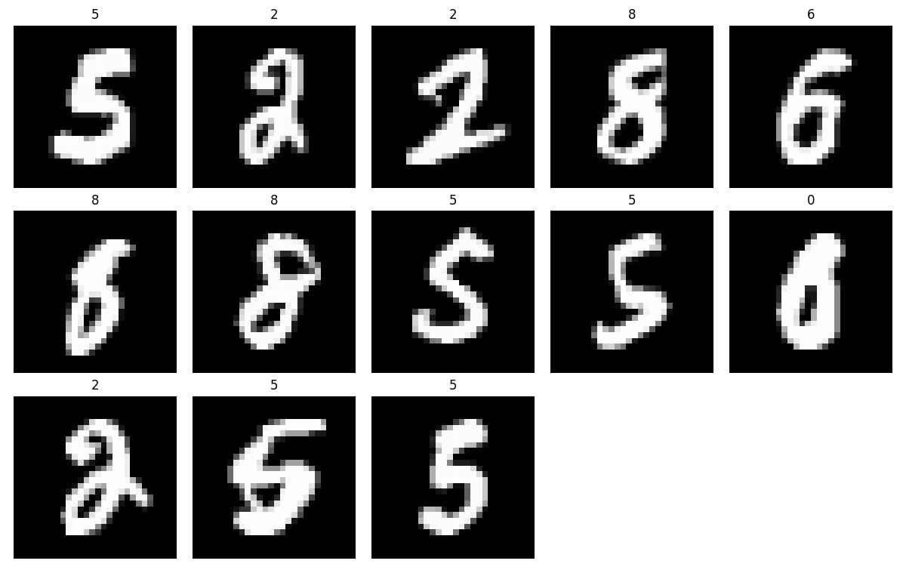

## 3. 考察

クラスタリングの結果を確認する限り、不自然な結果は得られていない。
一方、今回の結果は Refine 処理を実行する前の状態である。Refine 処理を行うことで、クラスタの精度は向上すると予測している。

Refine 適用後のクラスタ品質評価結果は、後日追加予定である。
