# Re-kNN 評価レポート: MNIST

> **"Deterministic logic reveals the truth hidden in high-dimensional noise."**

このレポートでは、MNIST 手書き数字データセット（テストデータ 10,000 件）に対する Re-kNN の推論性能を、未知判定閾値（decision threshold）ごとに評価した結果を示す。

## 実験条件

特に断りがない限り、本レポートの結果は以下の条件で取得した。

- インデックス登録対象データ: MNIST 60,000 件
- 評価データ: MNIST テストデータ 10,000 件
- 近傍数: k = 3
- インデックス構築時の Similarity: 0.95
- 未知判定閾値 (decision threshold): 各表に記載
- Refine: なし
- 実行環境: Ryzen 9 5900HX / Windows 11 / .NET 8

## 1. Re-kNN の性能

| 未知判定閾値 | 正答率 (Total Acc) | 未知判定率 | 誤答率 | 既知正答率 (Accuracy excluding Unknown) | 正答数 | 未知判定数 | 誤答数 | 備考 |
| :--- | :--- | :--- | :--- | :--- | :--- | :--- | :--- | :--- |
| **0.5** | 0.9599 | 0.0105 | 0.0296 | 0.9701 | 9599 | 105 | 296 | 実用ケースを想定 |
| **0.7** | 0.9312 | 0.0554 | 0.0134 | 0.9858 | 9312 | 554 | 134 | 信頼性重視設定 |
| **0.9** | 0.3814 | 0.6184 | **0.0002** | **0.9995** | 3814 | 6184 | 2 | **高信頼性設定** |

> * 正答率 (Total Acc) = 正答数 / 全テストデータ数 (10,000)
> * 既知正答率 (Accuracy excluding Unknown) = 正答数 / (正答数 + 誤答数)
> * 未知判定率 = 未知判定数 / 全テストデータ数 (10,000) 
> * 誤答率 = 誤答数 / 全テストデータ数 (10,000)

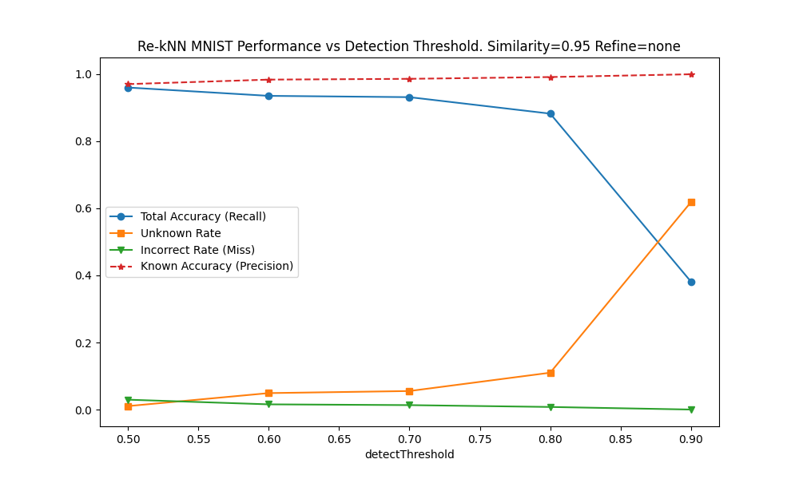

未知判定閾値を上げるほど誤答率は低下する一方、未知判定率は増加する。

### 混同行列

以下に混同行列を示す。

#### 未知判定閾値: 0.5

| テストラベル | 推論:0 | 推論:1 | 推論:2 | 推論:3 | 推論:4 | 推論:5 | 推論:6 | 推論:7 | 推論:8 | 推論:9 | 推論:未知 |
|:--:|--:|--:|--:|--:|--:|--:|--:|--:|--:|--:|--:|
| 0 | 969 | 1 | 0 | 0 | 0 | 0 | 2 | 1 | 2 | 0 | 5 |
| 1 | 0 | 1124 | 2 | 2 | 0 | 0 | 1 | 0 | 0 | 0 | 6 |
| 2 | 11 | 2 | 986 | 4 | 0 | 0 | 0 | 11 | 5 | 0 | 13 |
| 3 | 2 | 1 | 3 | 963 | 0 | 11 | 0 | 5 | 13 | 5 | 7 |
| 4 | 2 | 5 | 0 | 0 | 931 | 0 | 8 | 0 | 1 | 24 | 11 |
| 5 | 4 | 0 | 0 | 6 | 1 | 838 | 7 | 2 | 8 | 6 | 20 |
| 6 | 10 | 3 | 0 | 0 | 5 | 5 | 928 | 0 | 1 | 0 | 6 |
| 7 | 0 | 13 | 5 | 0 | 3 | 0 | 0 | 980 | 0 | 16 | 11 |
| 8 | 6 | 1 | 1 | 11 | 2 | 3 | 2 | 5 | 920 | 5 | 18 |
| 9 | 6 | 6 | 2 | 9 | 7 | 2 | 1 | 5 | 3 | 960 | 8 |

#### 未知判定閾値: 0.7

| テストラベル | 推論:0 | 推論:1 | 推論:2 | 推論:3 | 推論:4 | 推論:5 | 推論:6 | 推論:7 | 推論:8 | 推論:9 | 推論:未知 |
|:--:|--:|--:|--:|--:|--:|--:|--:|--:|--:|--:|--:|
| 0 | 966 | 1 | 0 | 0 | 0 | 0 | 0 | 1 | 2 | 0 | 10 |
| 1 | 0 | 1123 | 2 | 1 | 0 | 0 | 1 | 0 | 0 | 0 | 8 |
| 2 | 8 | 1 | 956 | 2 | 0 | 0 | 0 | 8 | 2 | 0 | 55 |
| 3 | 1 | 0 | 1 | 923 | 0 | 2 | 0 | 4 | 2 | 3 | 74 |
| 4 | 1 | 1 | 0 | 0 | 883 | 0 | 6 | 0 | 0 | 6 | 85 |
| 5 | 2 | 0 | 0 | 2 | 1 | 785 | 2 | 0 | 2 | 2 | 96 |
| 6 | 3 | 2 | 0 | 0 | 5 | 0 | 916 | 0 | 1 | 0 | 31 |
| 7 | 0 | 8 | 4 | 0 | 2 | 0 | 0 | 955 | 0 | 9 | 50 |
| 8 | 4 | 0 | 0 | 2 | 2 | 1 | 1 | 4 | 877 | 2 | 81 |
| 9 | 3 | 5 | 0 | 1 | 1 | 0 | 1 | 4 | 2 | 928 | 64 |

#### 未知判定閾値: 0.9

| テストラベル | 推論:0 | 推論:1 | 推論:2 | 推論:3 | 推論:4 | 推論:5 | 推論:6 | 推論:7 | 推論:8 | 推論:9 | 推論:未知 |
|:--:|--:|--:|--:|--:|--:|--:|--:|--:|--:|--:|--:|
| 0 | 623 | 0 | 0 | 0 | 0 | 0 | 0 | 0 | 0 | 0 | 357 |
| 1 | 0 | 1079 | 0 | 0 | 0 | 0 | 0 | 0 | 0 | 0 | 56 |
| 2 | 0 | 0 | 93 | 0 | 0 | 0 | 0 | 0 | 0 | 0 | 939 |
| 3 | 0 | 0 | 0 | 153 | 0 | 0 | 0 | 0 | 0 | 0 | 857 |
| 4 | 0 | 0 | 0 | 0 | 180 | 0 | 0 | 0 | 0 | 1 | 801 |
| 5 | 0 | 0 | 0 | 0 | 0 | 49 | 0 | 0 | 0 | 0 | 843 |
| 6 | 0 | 0 | 0 | 0 | 0 | 0 | 451 | 0 | 0 | 0 | 507 |
| 7 | 0 | 0 | 0 | 0 | 0 | 0 | 0 | 546 | 0 | 0 | 482 |
| 8 | 0 | 0 | 0 | 0 | 0 | 0 | 0 | 0 | 143 | 1 | 830 |
| 9 | 0 | 0 | 0 | 0 | 0 | 0 | 0 | 0 | 0 | 497 | 512 |

## 2. Re-kNN が誤答をしたケース

未知判定閾値 = 0.7 として実行した際の誤答ケースの解析結果を以下に示す。

全誤答件数: 134

### 例1: ラベル=9 のデータを ラベル=8 として誤答したケース

#### テストラベル
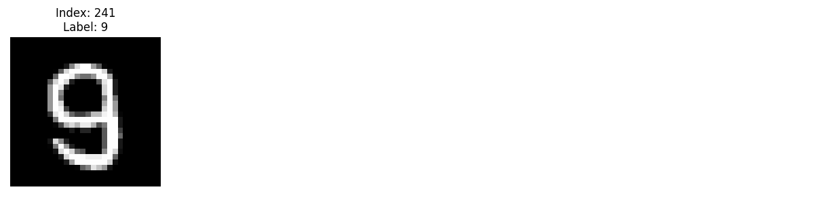

#### 判定根拠データ
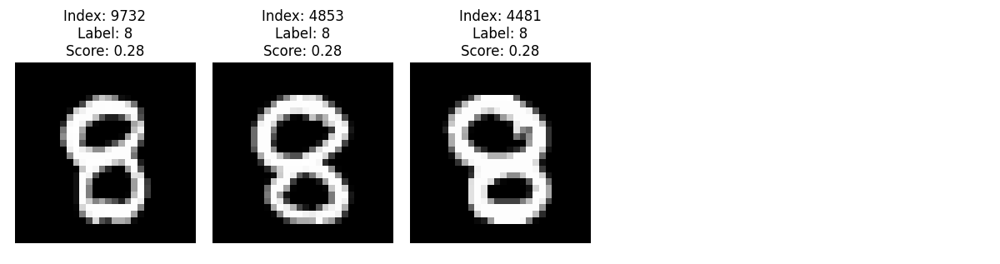

### 例2: ラベル=4 のデータを ラベル=6 として誤答したケース

#### テストラベル
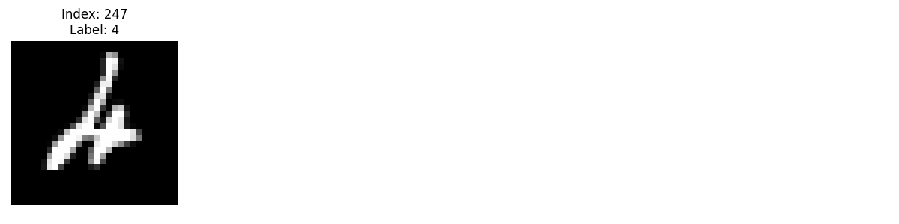

#### 判定根拠データ
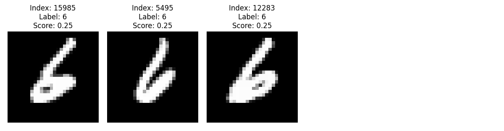

### 例3: ラベル=2 のデータを ラベル=7 として誤答したケース

#### テストラベル

#### 判定根拠データ
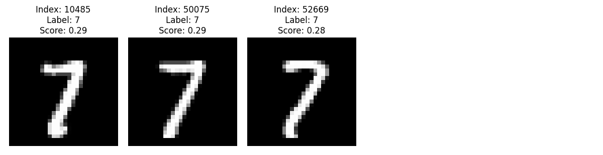

## 3. Re-kNN が未知と判定したケース

未知判定閾値 = 0.7 として実行した際の未知判定ケースの解析結果を以下に示す。

全未知判定件数: 554

### 例1: ラベル=5 のデータを未知と判定したケース

#### テストラベル
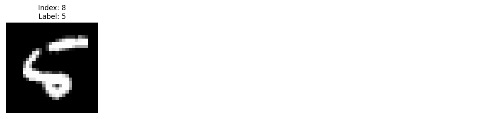

#### 判定根拠データ
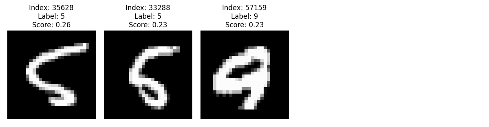

### 例2: ラベル=4 のデータを未知と判定したケース

#### テストラベル
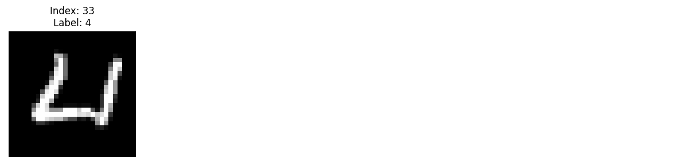

#### 判定根拠データ
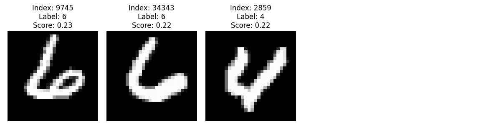

### 例3: ラベル=2 のデータを未知と判定したケース

#### テストラベル
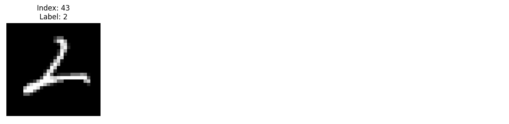

#### 判定根拠データ
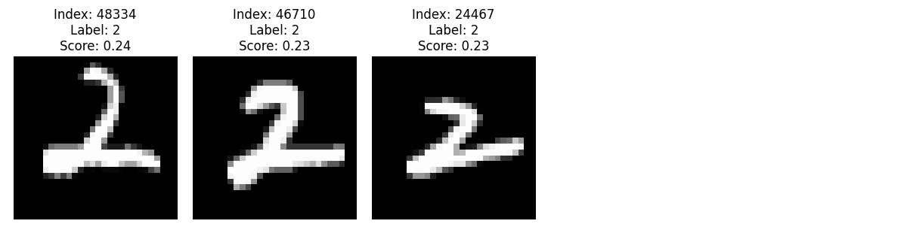

## 4. Refine 処理による性能改善

Refine 処理は、不適切な位置に配置されたデータを、より適切な位置へ再配置する処理である。

Refine 処理により、判定閾値を高くした場合に未知と判定されていた一部データを既知側へ振り分ける効果が確認できる。
判定閾値=0.9 の場合、多くのデータは未知としてフィルタリングされるが、Refine 適用後は、差分としては、未知が 36 件減少し、その内訳は正答の 35 件増加と誤答の 1 件増加に対応している。
一方で、既知と判定したデータに対する正答率は 99.95% から 99.92% へわずかに低下している。さらなる検証は必要だが、Refine 処理には、高い未知判定閾値の下で未知データの一部を既知側へ再配分する効果がある可能性がある。

| Refine | 未知判定閾値 | 正答率 (Total Acc) | 未知判定率 | 誤答率 | 既知正答率 (Accuracy excluding Unknown) | 正答数 | 未知判定数 | 誤答数 | 備考 |
| :--- | :--- | :--- | :--- | :--- | :--- | :--- | :--- | :--- | :--- |
| none | 0.5 | 0.9599 | 0.0105 | 0.0296 | 0.9700859019706922 | 9599 | 105 | 296 | - |
| none | 0.7 | 0.9312 | 0.0554 | 0.0134 | 0.9858141012068601 | 9312 | 554 | 134 | - |
| none | 0.9 | 0.3814 | 0.6184 | 0.0002 | 0.999475890985325 | 3814 | 6184 | 2 | - |
| 0.01 | 0.5 | 0.9593 | 0.0105 | 0.0302 | 0.9694795351187468 | 9593 | 105 | 302 | - |
| 0.01 | 0.7 | 0.9325 | 0.0535 | 0.014 | 0.9852086634970946 | 9325 | 535 | 140 | - |
| 0.01 | 0.9 | 0.3849 | 0.6148 | 0.0003 | 0.9992211838006231 | 3849 | 6148 | 3 |  - |

.png)

* **Note**: `Refine = 0.01` は Refine 処理の終了判定値を示す。これは、Refine 対象データの割合が全体の 1% を下回った時点で処理を終了することを意味する。

## 5. 推論時間

MNIST の全テストデータ (10,000件) に対して推論を行った際の所要時間を以下に示す。

* **測定環境**: Ryzen 9 5900HX (3.3GHz) / Windows 11 / .NET 8
* **対象データ**: MNIST (784次元)
* **総処理時間 (10,000件)**: $4,350.51 ms$
* **1件あたりの平均レイテンシ**: **$435\ \mu s$**

## 6. 未知の判別

MNIST において、0から9のラベルをそれぞれ学習しない状態で評価を行った際の結果を以下に示す。未知判定閾値 = 0.7 での評価結果である。

### 未知を含めて評価した結果

| 未知ラベル | 正答率 (Total Acc) | 未知判定率 | 誤答率 | 正答数 | 未知判定数 | 誤答数 | 備考 |
|:---:|:---|:---|:---|---:|---:|---:|:---|
| 0 | 0.8388 | 0.1178 | 0.0434 | 8388 | 1178 | 434 |  |
| 1 | 0.8218 | 0.1290 | 0.0492 | 8218 | 1290 | 492 |  |
| 2 | 0.8366 | 0.1131 | 0.0503 | 8366 | 1131 | 503 |  |
| 3 | 0.8454 | 0.0901 | 0.0645 | 8454 | 901 | 645 |  |
| 4 | 0.8456 | 0.0587 | 0.0957 | 8456 | 587 | 957 |  |
| 5 | 0.8569 | 0.0875 | 0.0556 | 8569 | 875 | 556 |  |
| 6 | 0.8419 | 0.1034 | 0.0547 | 8419 | 1034 | 547 |  |
| 7 | 0.8374 | 0.0808 | 0.0818 | 8374 | 808 | 818 |  |
| 8 | 0.8500 | 0.0935 | 0.0565 | 8500 | 935 | 565 |  |
| 9 | 0.8489 | 0.0719 | 0.0792 | 8489 | 719 | 792 |  |
| なし | 0.9312 | 0.0554 | 0.0134 | 9312 | 554 | 134 |  |

.png)

.png)

### 未知を除外した状態での評価結果

| 未知ラベル | 正答率 (Total Acc) | 既知正答率 (Accuracy excluding Unknown) | 正答数 | 誤答数 | 未知判定数 | 備考 |
|:---:|:---|:---|---:|---:|---:|:---|
| 0 | 0.9299 | 0.9865 | 8388 | 115 | 517 |  |
| 1 | 0.9270 | 0.9871 | 8218 | 107 | 540 |  |
| 2 | 0.9329 | 0.9857 | 8366 | 121 | 481 |  |
| 3 | 0.9404 | 0.9874 | 8454 | 108 | 428 |  |
| 4 | 0.9377 | 0.9860 | 8456 | 120 | 442 |  |
| 5 | 0.9408 | 0.9866 | 8569 | 116 | 423 |  |
| 6 | 0.9311 | 0.9870 | 8419 | 111 | 512 |  |
| 7 | 0.9333 | 0.9883 | 8374 | 99 | 499 |  |
| 8 | 0.9417 | 0.9884 | 8500 | 100 | 426 |  |
| 9 | 0.9442 | 0.9897 | 8489 | 88 | 414 |  |
| なし | 0.9312 | 0.9858 | 9312 | 134 | 554 |  |

.png)

.png)

### 未知の評価結果

インデックスに登録しなかったラベル(=未知ラベル)の判定結果は **未知** もしくは **誤答** のどちらかとなる。

| 未知ラベル | 未知判定率 | 誤答率 | 未知判定数 | 誤答数 | 備考 |
|:---:|:---|:---|---:|---:|:---|
| 0 | 0.6745 | 0.3255 | 661 | 319 |  |
| 1 | 0.6608 | 0.3392  | 750 | 385 |  |
| 2 | 0.6298 | 0.3702 | 650 | 382 |  |
| 3 | 0.4683 | 0.5317 | 473 | 537 |  |
| 4 | 0.1477 | 0.8523 | 145 | 837 |  |
| 5 | 0.5067 | 0.4933 | 452 | 440 |  |
| 6 | 0.5449 | 0.4551 | 522 | 436 |  |
| 7 | 0.3006 | 0.6994 | 309 | 719 |  |
| 8 | 0.5226 | 0.4774 | 509 | 465 |  |
| 9 | 0.3023 | 0.6977 | 305 | 704 |  |

.png)

### 考察

MNIST において、形状が似ているラベル ( 4, 7, 9 ) は未知判定率が低い。
これは、形状が類似しているために発生する問題だと考えている。
近傍検索により、これらのケースでは形状の近いデータが比較的高い類似度で検出される。
実際に利用する場合は、ユースケースにあわせて、判定閾値で感度を調整することが必要だと考えている。
この傾向はラベル4で顕著である。形状として近しいため、類似度が高くなる傾向を反映した結果であると考察する。

## 7. メモリ消費

MNISTのデータを全て読み込んだ状態でのメモリ消費量を以下に示す。

* **測定環境**: Ryzen 9 5900HX (3.3GHz) / Windows 11 / .NET 8
* **測定条件**: インデックス情報を全て読み込んだ直後の状態
* **他プロセス条件**: Windows で動作する他のプロセスは稼働中である
* **対象データ**: MNIST (784次元)
* **メモリ消費量**: 473.0MB (タスクマネージャーのプロセスタブのメモリ項目での測定値)

---
*Created by Re-kNN Evaluation Suite (2026)*

