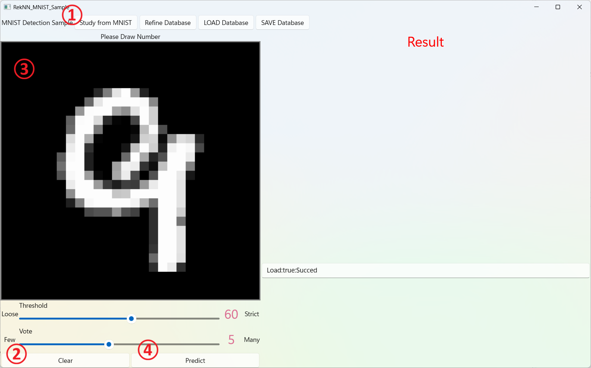
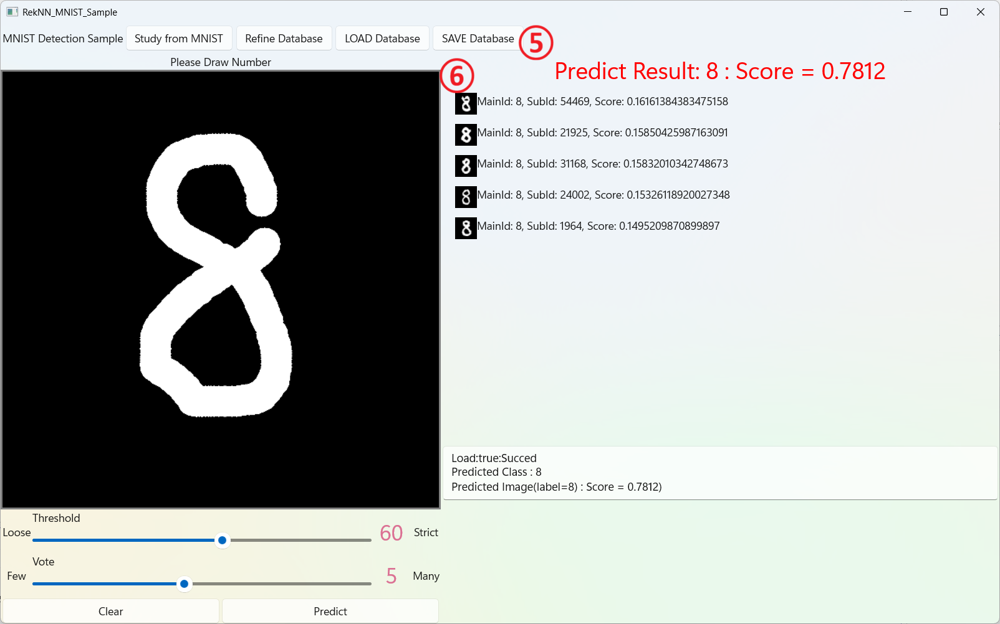

# MNIST Sample Application

## 概要

- MNIST データセットを用いて、手書き数字認識を行うサンプルアプリケーションです。
- Windows 用のアプリケーションです。WinUI で実装しています。
- 画面左側の黒いエリアに、マウス等で数字または任意の図形・文字を書き込んでください。
- `Predict` ボタンを押すと推論を開始し、結果を画面右側に表示します。
- 判定元になるデータが MNIST であるため、推論結果は数字または `Unknown` となります。

## 特徴

このサンプルアプリケーションでは、入力データを数字として十分に判定できない場合、`Unknown` として回答します。  
また、推論結果だけでなく、推論の根拠となったデータも表示します。

## 使用方法

### MNIST のデータ準備

1. MNIST のデータをダウンロードしてください。

例）  
https://www.kaggle.com/datasets/hojjatk/mnist-dataset

2. `settings.json` ファイルを修正してください。

以下のファイルを修正してください。

```text
RekNN_MNIST_Sample/settings.json
```

修正例：

```json
{
  "TrainImageFilePath": "C:\\Users\\tokad\\Documents\\FuutaSystemService\\MNIST\\train-images.idx3-ubyte",
  "TrainLabelFilePath": "C:\\Users\\tokad\\Documents\\FuutaSystemService\\MNIST\\train-labels.idx1-ubyte",
  "TestImageFilePath": "C:\\Users\\tokad\\Documents\\FuutaSystemService\\MNIST\\t10k-images.idx3-ubyte",
  "TestLabelFilePath": "C:\\Users\\tokad\\Documents\\FuutaSystemService\\MNIST\\t10k-labels.idx1-ubyte",
  "DatabasePath": "C:\\Users\\tokad\\Documents\\FuutaSystemService\\MNIST-Sample\\database",
  "SimilarityThreshold": 0.9,
  "SearchMaxNumForAddVector": 5
}
```

`SimilarityThreshold` と `SearchMaxNumForAddVector` は、通常は変更不要です。

## 画面イメージ



1. MNIST のデータを用意して `Study from MNIST` ボタンを押して DB に登録してください。DB 登録後、保存処理は自動で実行されます。MNIST データの場所は `settings.json` で定義します。DB 登録後の起動では保存済みの DB を自動的に読み込むため、このボタンは通常使用しません。
2. 起動直後は、手書き領域にサンプルデータが表示されています。`Clear` ボタンを押して、手書き領域を初期化してください。
3. 手書き領域に、マウスで数字または任意の図形・文字を書いてください。
4. 手書きが終了したら `Predict` ボタンを押してください。推論を実行します。



5. 推論結果がここに表示されます。この例では `8` と推論しています。また、その際のスコアが右側に表示されます。このスコアが判定値を満たさない場合は `Unknown` となります。
6. 推論根拠がここに表示されます。投票数で指定した数だけ根拠データを表示します。各根拠にはスコアが付与されています。

なお、上で説明していないボタン等の情報は以下の通りです。

* `Refine Database` : DB 全体に対して Refine 処理を実行します。処理後、自動的に DB を保存します。
* `Load Database` : DB を読み込みます。
* `Save Database` : DB を書き出します。
* 右下の TextBox : 動作ログを表示します。

## オプション

このアプリケーションでは、判定値と投票数をスライダーで変更できます。

### 判定値

推論結果を採用するかどうかを判断するためのしきい値です。
10～99 の間の値を設定できます。

`Score` が `設定値 × 0.01` を超えた場合に推論結果を採用します。
この条件を満たさない場合は `Unknown` とします。

### 投票数

判定する際に参考とするデータの数です。
1～10 の間の値を指定できます。

k-NN の `k` に相当する値ですが、本アプリケーションではスコアベースで判定を行うため、`k=2` のような小さい値でも利用できます。

## 注意点

* 投票数が 1 の場合でも、スコアが低い場合は `Unknown` となります。
* k-NN に似た考え方を含みますが、同一のものではありません。別の仕組みとして考えてください。
* 本アプリケーションは、根拠付き推論を確認するためのサンプルです。データの逐次追加 / 削除は実装していません。
* `Refine` 処理も実装していますが、このサンプルでは結果への影響は軽微です。これは、MNIST データセットの規模が比較的小さいためです。


