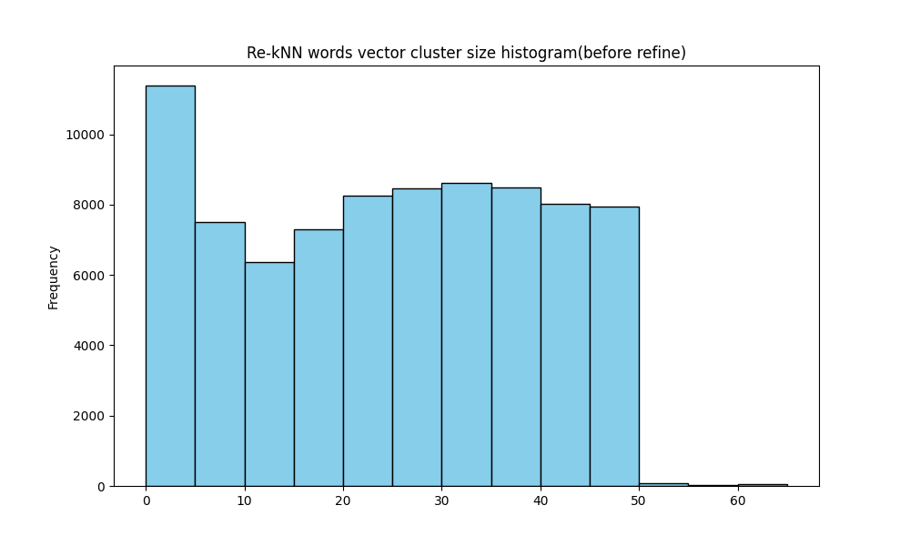
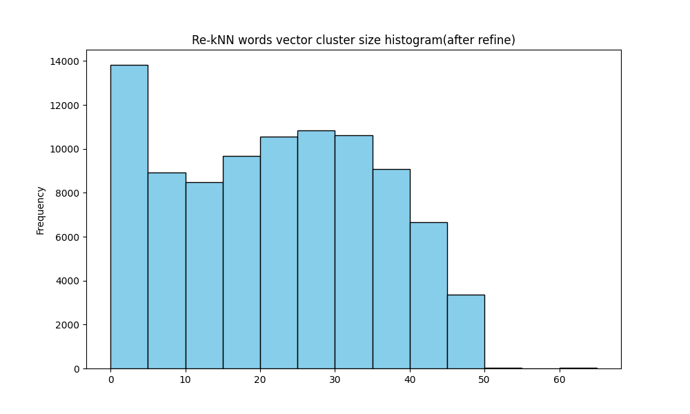

# Semantic Context Clustering / Similar Word Clustering

This repository publishes clusters generated by Re-kNN from large-scale word vectors consisting of several million entries.
The output is expected to be useful as a source of candidates when building synonym dictionaries or searching for related terms.
However, please note that this output is only the result of clustering similar words and is different from a manually curated dictionary.

## Target Data

This evaluation used the following dataset.

- fastText English vectors

crawl-300d-2M.vec.zip (https://dl.fbaipublicfiles.com/fasttext/vectors-english/crawl-300d-2M.vec.zip) : 2 million word vectors trained on Common Crawl (600B tokens).

## License

In accordance with the license of the original dataset, the clustering results are released under the Creative Commons Attribution-Share-Alike License 3.0 (https://creativecommons.org/licenses/by-sa/3.0/).
Please note that this license is different from the license applied to sample code and other materials.

## Results

### Execution Environment

- CPU : AMD Ryzen 9 5900HX
- Physical Memory : 64 GiB
- OS : Windows 11 Pro
- GPU : **Not used**
- Execution : Single thread
- Dataset : fastText `crawl-300d-2M.vec`
- Vector dimensions : 300
- Number of vectors : 2,000,000

### Evaluation Conditions

The evaluation was conducted both with and without the Refine process.
The Refine process re-evaluates data that may have been placed in inappropriate positions during data registration and relocates it to more appropriate positions.
Even if such placement differences are unlikely to cause major issues during inference, they can affect the cluster structure during clustering. Therefore, this evaluation compares the results before and after Refine.

### Clustering Results

* crawl-300d-2M.vec (After registration): [crawl-300d-2M-095-AfterRegistration.txt](../SemanticContextClustering/crawl-300d-2M-095-AfterRegistration.txt)
* crawl-300d-2M.vec (After Refine): [crawl-300d-2M-095-AfterRefine.txt](../SemanticContextClustering/crawl-300d-2M-095-AfterRefine.txt)

#### Statistics

| Step | Time | Clusters | Avg size | Median size | Max size | Standard Deviation | Singleton clusters | Singleton Ratio |
|---|---:|---:|---:|---:|---:|---:|---:|---:|
| After registration | 6 h 44 m | 82,463 | 24.3 | 25 | 190 | 14.75 | 2,120 | 2.6% |
| After Refine | 11 h 02 m total<br>(6 h 44 m + 4 h 18 m) | 92,051 | 21.7 | 22 | 190 | 13.47 | 3,574 | 3.9% |

#### Example of a cluster containing `vector` (After registration)

```text
array matrix pipelined divider loop loops comparators Comparators Comparator output outputs input inputs sub-arrays subarrays sub-array Array arrays Arrays carry-save subtractor 3-input three-input noninverted row-column fan-out vectors vector matrices buffers buffer FIFO partition comparitor comparator arrays.The
````

#### Example of a cluster containing `vector` (After Refine)

```text
vectorized vectoring Bresenham Vectorizing Vectorize Vectorized vectored vectorize vectorizing vectorised Vectorization Vectored non-vector Vector-based vectorise Vector- vector vectors Vector vector-based vector- vectors.The vectorial
```

The above examples show clusters containing `vector`.
These results suggest that, after the Refine process, words that appear to have relatively low relevance within the cluster, such as `loop`, were separated.
This indicates that the Refine process adjusted the cluster contents into a more appropriate structure.

#### Example of the largest cluster (After registration):

The full clustering result is stored in `samples/largest_cluster_after_registration.txt`.

```text
28.4Km 29.2Km 28.6Km 28.3Km 27.5Km ... 4.6Km 4.2Km kmLa 0.2Km 0.3Km
```

#### Example of the largest cluster (After Refine):

```text
28.4Km 29.2Km 28.6Km 28.3Km 27.5Km ... 4.6Km 4.2Km 0.2Km 0.3Km Péniche
```

The largest cluster mainly consists of distance-expression tokens such as `28.4Km`, `29.2Km`, and `28.6Km`.
This shows that Re-kNN clusters tokens with similar meanings, usage patterns, or surface patterns.
The cluster also includes noisy tokens such as `ListLe`, `HotelsLe`, and `kmLa`. These are presumed to originate from the content of the underlying Common Crawl documents.

Such noise is considered to occur because the original vectors include spelling variations, parsing errors, compound words, mixed-language tokens, and other artifacts derived from Common Crawl.
In particular, tokens containing character patterns such as `Km`, `Le`, and `La` are positioned close to each other, suggesting that the vocabulary characteristics of the original corpus and vectors are reflected in the clusters.

##### Cluster Distribution After Registration



##### Cluster Distribution After Refine



##### Comparison of Cluster Distributions

| Cluster size | After registration | After Refine |
| -----------: | -----------------: | -----------: |
|          1-4 |             11,386 |       13,822 |
|          5-9 |              7,511 |        8,907 |
|        10-14 |              6,373 |        8,485 |
|        15-19 |              7,289 |        9,671 |
|        20-24 |              8,247 |       10,545 |
|        25-29 |              8,459 |       10,843 |
|        30-34 |              8,627 |       10,618 |
|        35-39 |              8,480 |        9,081 |
|        40-44 |              8,014 |        6,646 |
|        45-49 |              7,950 |        3,354 |
|        50-54 |                 73 |           40 |
|        55-59 |                 15 |           14 |
|          60+ |                 39 |           25 |

##### Resource Usage (Maximum Values)

| Step               | WorkingSet64 | PrivateMemorySize64 | PeakWorkingSet64 | GC.GetTotalMemory(false) |
| ------------------ | -----------: | ------------------: | ---------------: | -----------------------: |
| After registration |     6.19 GiB |            6.23 GiB |         6.27 GiB |                 2.28 GiB |
| After Refine       |     6.93 GiB |            6.97 GiB |         6.93 GiB |                 2.34 GiB |

## Discussion

Re-kNN generated 82,463 semantic clusters from 2,000,000 300-dimensional fastText English word vectors in 6 h 44 m.
This process was executed on a Ryzen 9 5900HX in a single-threaded environment, without using a GPU.

After the Refine process, the number of clusters increased to 92,051, and the average cluster size decreased from 24.3 to 21.7.
The standard deviation also decreased from 14.75 to 13.47, suggesting that the cluster size distribution became somewhat more stable after Refine.
The results indicate that the Refine process split some medium-to-large clusters into finer clusters, shifting the overall cluster size distribution slightly toward smaller sizes.

The Singleton Ratio increased from 2.6% to 3.9%, but it remained at a low level.
This indicates that, although some words were separated into finer clusters by Refine, the process did not produce a large number of isolated clusters.

The largest cluster contained 190 word vectors in both cases, and its contents mainly consisted of distance expressions such as `28.4Km`, `29.2Km`, and `27.5Km`.
This can be regarded as an example where surface patterns and vocabulary characteristics derived from Common Crawl were reflected in the cluster.

This output is not a manually curated synonym dictionary.
It is a semantic clustering output that may include synonyms, related terms, spelling variations, named entities, and corpus-derived noise.
Therefore, in practical use, it is appropriate to treat this output as an initial source of synonym or related-term candidates, or as a starting point for building domain-specific dictionaries.

Even though the dataset consists of 2 million word vectors, Re-kNN completed the clustering within a practical amount of time using a single thread, while keeping peak memory usage (`PeakWorkingSet64`) below 7 GiB.
This demonstrates the resource efficiency of Re-kNN.


